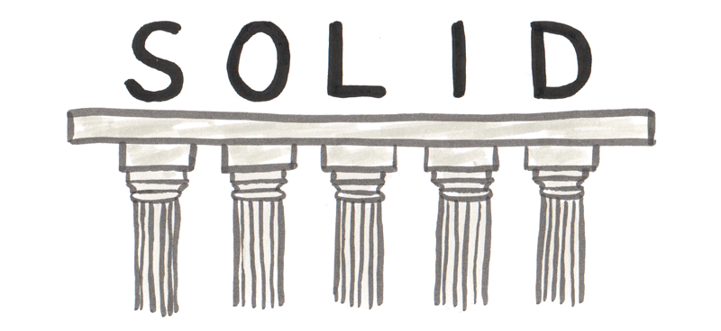

- SRP: Single Responsibility Principle (Принцип единой ответственности)  
- OCP: Open-Closed Principle (Принцип открытости-закрытости)  
- LSP: Liskov Substitution Principle (Принцип подстановки Барбары Лисков)  
- ISP: Interface Segregation Principle (Принцип разделения интерфейса)  
- DIP: Dependency Inversion Principle (Принцип инверсии зависимостей)  

:::info Уточнение
Здесь и далее модуль это класс или функция
:::

Принцип единственной ответственности
------------------------------------

1. Модуль должен реализовывать один и только один функционал.
2. Должна быть одна и только одна причина (actor) изменения этого функционала.
3. Причины (акторы), это по сути пользователи этого функционала.

:::danger Внимание кодерам!
Если в обычном языке добавить новое слово, то ничего не поломается,
а вот если изменить имеющееся слово (по сути его смысл),
то это может привести к весьма печальным последствиям.
В программах слова это классы и функции. Их нельзя изменять!
:::

Принцип открытости-закрытости
-----------------------------

1. Модули должны быть открыты для расширения, но закрыты для изменения.
2. Изменение это редактирование кода модуля.
3. Расширение это добавление нового функционала (но не в модуль, а в библиотеку или программу).

Принцип подстановки Барбары Лисков
----------------------------------

1. Квадрат это не частный случай Прямоугольника. 
2. Интерфейс потомков не должен менять интерфейс предка.   
3. Перечисления запрещаем (enum, switch, catch, if/else и т.п.).
4. Перечисления можно использовать, если есть гарантии что они конечные.

Принцип разделения интерфейса
-----------------------------

1. Наследуемые классы не должны содержать не реализованный интерфейс

:::info Пример
Например Бесплатная парковка, если она наследуется от Парковки, вынуждена реализовать
методы оплаты (несмотря на то, что она бесплатная). Решение: сделать два интерфейса Почасовая оплата и Парковка.
И сделать классы Бесплатная парковка (реализует Парковку) и Платная парковка (реализует оба интерфейса).
:::

Принцип инверсии зависимостей
-----------------------------

1. Классы должны зависеть от интерфейсов или абстрактных классов.
2. Класс нельзя наследовать от конкретного класса.

Курсы
-----

https://www.udemy.com/course/solid-connascence/  
https://futurio.ru/  