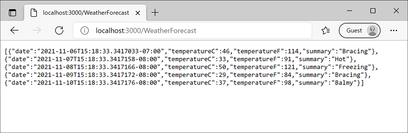

Запуск Docker-контейнера
========================

Вы можете запустить свое приложение в контейнере с помощью следующей команды:

```bash
docker run -it --rm -p 3000:80 --name mymicroservicecontainer mymicroservice
```

Вы можете перейти по следующему URL-адресу, чтобы получить доступ к вашему приложению, 
работающему в контейнере:http://localhost:3000/WeatherForecast



При желании вы можете просмотреть свой контейнер, работающий в отдельной командной строке, используя следующую команду:

```bash
docker ps
```

Нажмите `Ctrl+C` в командной строке, чтобы завершить `docker run` команду, запускающую службу в контейнере.

Поздравляем! Вы успешно создали небольшую независимую службу, которую можно развернуть
и масштабировать с помощью контейнеров `Docker`.

Это основные строительные блоки микросервисов.


Следующие шаги
--------------

Поздравляем! Вы создали простую службу, а затем запустили ее в контейнере `Docker`.

Теперь вы можете узнать, как развернуть свою микрослужбу в облаке с помощью нашего следующего руководства.

[Учебник. Развертывание микрослужбы в Azure][learn-deploy]

[learn-deploy]: https://dotnet.microsoft.com/en-us/learn/aspnet/deploy-microservice-tutorial/intro

