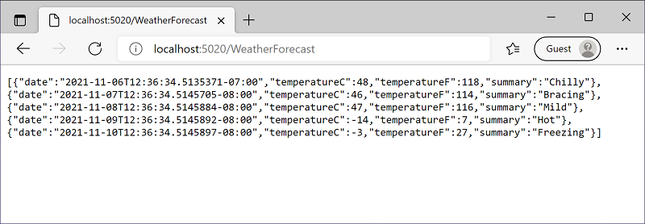
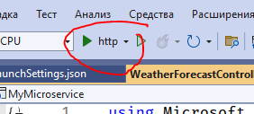
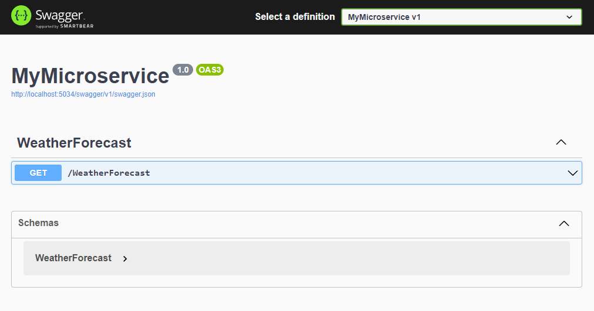

Запуск микросервиса
===================

В командной строке выполните следующую команду:

```bash
dotnet run
```

Вы должны увидеть вывод, подобный следующему:

```bash
Building...
info: Microsoft.Hosting.Lifetime[14]
Now listening on: http://localhost:5034
info: Microsoft.Hosting.Lifetime[0]
Application started. Press Ctrl+C to shut down.
info: Microsoft.Hosting.Lifetime[0]
Hosting environment: Development
info: Microsoft.Hosting.Lifetime[0]
Content root path: C:\Users\Ana\MyMicroservice\
```

Подождите, пока приложение отобразит, что оно прослушивает `http://localhost:<номер порта>`, 
а затем откройте браузер и перейдите по адресу `http://localhost:<номер порта>/WeatherForecast`.

В этом примере показано, что прослушивается порт 5034, поэтому на следующем изображении 
показан URL-адрес http://localhost:5034/WeatherForecast.



Запуск в среде Visual Studio
----------------------------

Проект можно открыть `Visual Studio` и запустить привычным способом.



:::caution
При открытии студия попросит сохранить файл решения. Сохраняйте его в корне проекта.
:::

После запуска вас автоматически перебросит в браузер по адресу:

http://localhost:5034/swagger/index.html

Здесь вы можете изучать API, который создаете в микросервисе:



Можете перейти по адресу http://localhost:5034/WeatherForecast и проверить как работает ваш API:

```json
[
  {
    "date": "2023-07-06",
    "temperatureC": -20,
    "temperatureF": -3,
    "summary": "Hot"
  },
  {
    "date": "2023-07-07",
    "temperatureC": 7,
    "temperatureF": 44,
    "summary": "Sweltering"
  },
  {
    "date": "2023-07-08",
    "temperatureC": 28,
    "temperatureF": 82,
    "summary": "Hot"
  },
  {
    "date": "2023-07-09",
    "temperatureC": 10,
    "temperatureF": 49,
    "summary": "Freezing"
  },
  {
    "date": "2023-07-10",
    "temperatureC": 24,
    "temperatureF": 75,
    "summary": "Mild"
  }
]
```